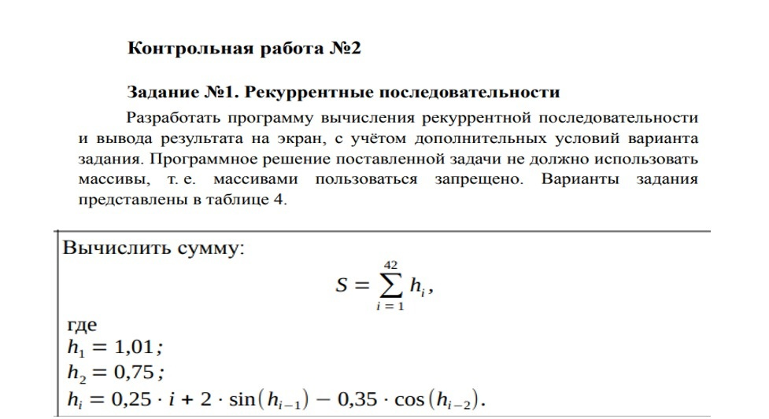
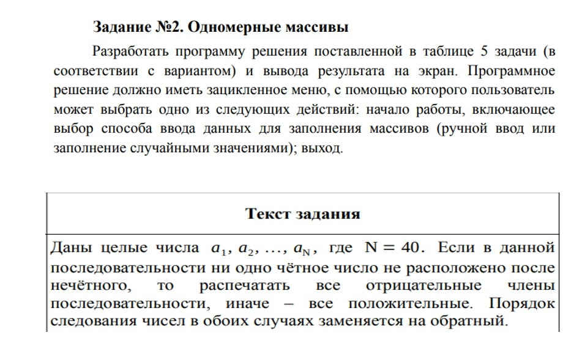
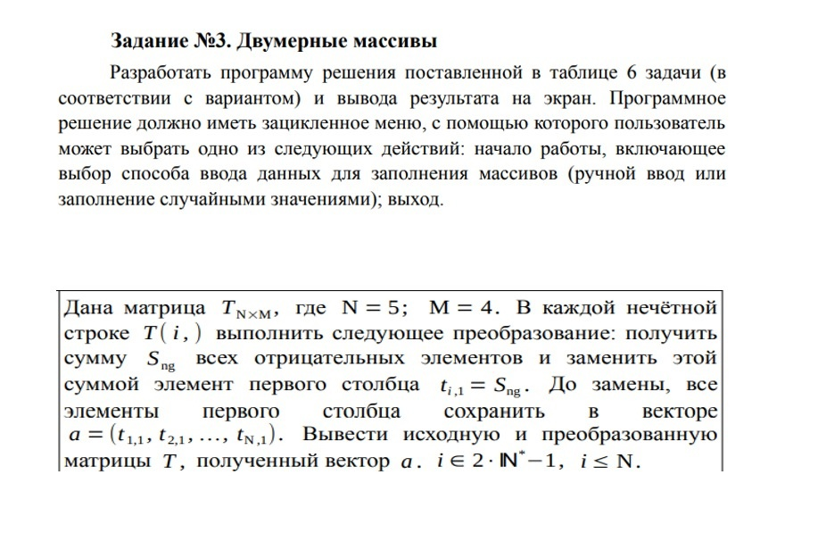

# CW2_Fares
Conrtol work #2. X (unknown) variant.

<h2>Control work #2</h2>
<h3>Task 1. Recurrent sequences</h3>

&emsp;Develop a program for calculating the recurrent sequence
and displaying the result on the screen, taking into account the additional conditions
of the task variant. The software solution of the task should not use
arrays, i.e. arrays are forbidden to use. The task options
are presented in Table 4.

<h3>Task 2. One dimensional arrays</h3>

&emsp;Develop a program for solving the task set in Table 5 (
according to the option) and displaying the result on the screen. The software
solution should have a looped menu with which the user
can choose one of the following actions: getting started, including
the choice of the data input method for filling arrays (manual input or
filling with random values); exit.
Table 5 - Options for task No. 2 of control work No. 2

<h3>Task 3. Two dimensional arrays</h3>

&emsp;Develop a program for solving the task set out in Table 6 (in
accordance with the option) and displaying the result on the screen. The software
solution should have a looped menu with which the user
can choose one of the following actions: getting started, including
the choice of the data input method for filling arrays (manual input or
filling with random values); exit.

