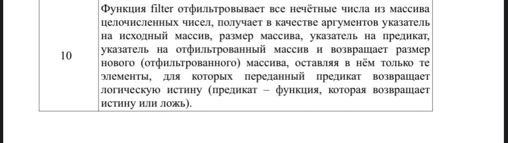

# CW3_Kongdi

<h2>Control work #3. 10 variant.</h2>

<h3>Task 1. Dynamic memory allocation</h3>
    

        &emsp;Develop a program for solving the task set out in Table 7 (in
        accordance with the option) and displaying the result on the screen.
        The user enters the values of n and t from the keyboard (n ∈ N, m ∈ N). The software solution
        should: use the mechanism of dynamic allocation of memory from the heap
        (it is forbidden to allocate memory on the stack for dynamic arrays);
        free up allocated memory and assign NULL value to the pointer;
        have a looped menu with which the user can select
        the "getting started" action, which includes the choice of the data input method for
        filling arrays (manual input or filling with random values),
        the "exit" action.
    

<h3>Task 2. Working with bits</h3>
    

        &emsp;Develop a program for solving the problem set in Table 8 (in
        accordance with the option) and displaying on the screen: the entered and converted
        sequences in the original and octal forms.
        The user enters the initial data from the keyboard. The software implementation should:
        use one or more
        bitwise operations of the C language to solve the task; have a looped menu with
        which the user can select the "getting started" action,
        including the choice of the data input method for filling arrays (manual input
        or filling with random values), the "exit" action. The count of the sequence numbers of bits starts with 1.
    

<h3>Task 3. Pointers to functions</h3>
    

        &emsp;Develop a function that solves the task set out in Table 9 (in
        accordance with the option) and a software solution for testing it and
        displaying the result on the screen. The software implementation should: use
        pointers to functions to solve the task; have a looped
        menu with which the user can select the "getting started
        " action, including the choice of the data input method for filling arrays
        (manual input or filling with random values), the "exit" action.
    

