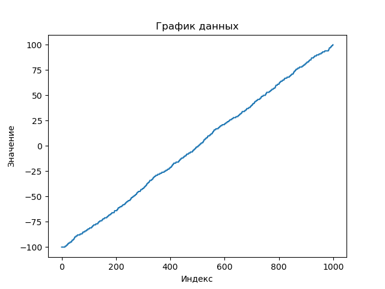
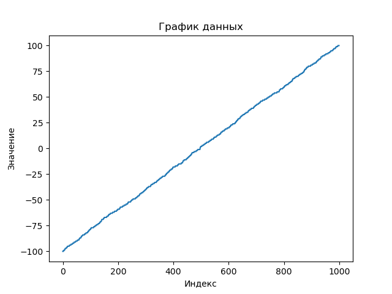
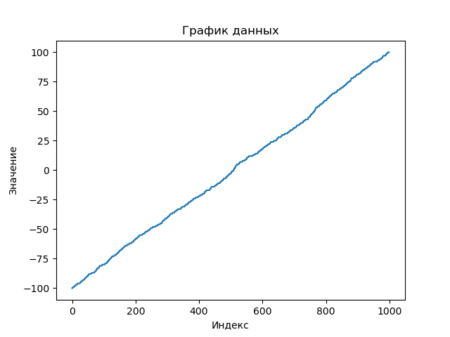
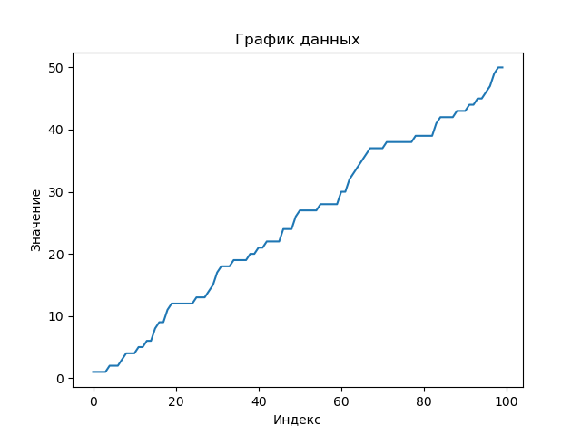
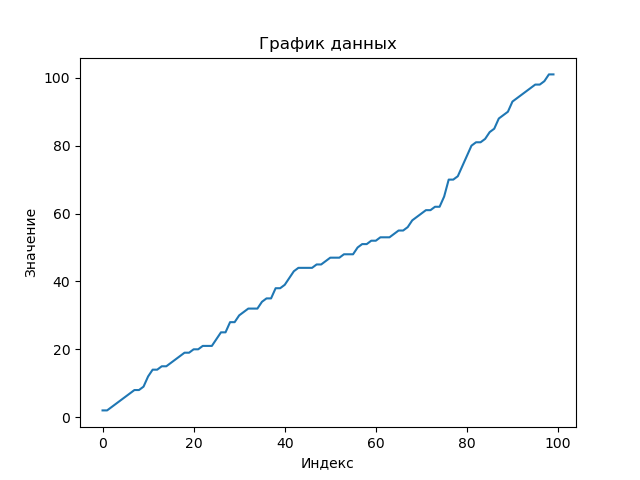
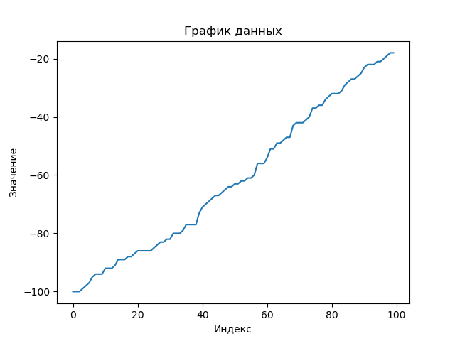

# Сортировка данных и визуализация

Этот проект предоставляет инструменты для загрузки, сортировки и визуализации данных.

## Описание

Проект состоит из нескольких модулей:

- `array_generator.py`: генерирует массивы случайных чисел в заданном диапазоне.
- `data_loader.py`: загружает численные значения из указанного файла.
- `data_saver.py`: сохраняет отсортированные данные в указанный файл.
- `plot_saver.py` и `plotter.py`: строят и сохраняют графики данных соответственно.
- `selection_sort.py`: реализует алгоритм сортировки выбором для списка.

## Использование

### Описание модулей

#### array_generator.py

Модуль `array_generator.py` предоставляет функцию `generate_random_array()` для создания случайных массивов.

#### data_loader.py

Модуль `data_loader.py` содержит функцию `load_data_from_file()` для загрузки численных значений из файла.

#### data_saver.py

Модуль `data_saver.py` предоставляет функцию `save_sorted_data_to_file()` для сохранения отсортированных данных в файл.

#### plot_saver.py и plotter.py

Модули `plot_saver.py` и `plotter.py` предоставляют функции для построения и сохранения графиков данных.

#### selection_sort.py

Модуль `selection_sort.py` содержит функцию `selection_sort()` для сортировки списка методом выбора.

### Пример использования

Пример использования модулей для работы с данными и графиками можно найти в файле `main.py`. Запустив этот файл, вы сможете:

- Загрузить данные из файлов и сгенерировать случайные массивы.
- Отсортировать данные и сохранить их в новых файлах.
- Построить и сохранить графики отсортированных данных.

