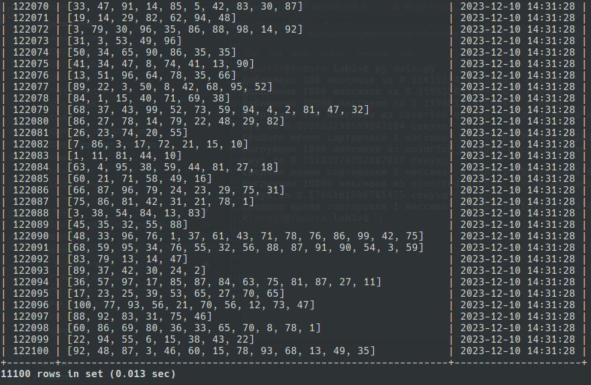

# Работа с массивами в базе данных

Данный проект содержит скрипты на Python для работы с массивами в базе данных. Программа позволяет добавлять массивы случайных чисел в базу данных, выгружать их, сортировать и записывать отсортированные массивы в другую таблицу, а также очищать базу данных от всех записей.

## Начало работы

### Установка зависимостей

Для запуска программы у вас должен быть установлен Python и библиотека mysql-connector-python. Установите библиотеку с помощью pip:

```bash
pip install mysql-connector-python
```

### Настройка базы данных

Сначала убедитесь, что у вас установлена и запущена MariaDB (или MySQL). Далее необходимо создать базу данных и таблицы для работы с массивами.

```sql
CREATE USER 'user'@'localhost' IDENTIFIED BY 'password';
GRANT ALL PRIVILEGES ON array_storage.* TO 'user'@'localhost';

CREATE DATABASE IF NOT EXISTS array_storage;

CREATE TABLE IF NOT EXISTS array_storage.unsorted_arrays (
    id INT AUTO_INCREMENT PRIMARY KEY,
    array_data TEXT,
    created_at TIMESTAMP DEFAULT CURRENT_TIMESTAMP
);

CREATE TABLE IF NOT EXISTS array_storage.sorted_arrays (
    id INT AUTO_INCREMENT PRIMARY KEY,
    array_data TEXT,
    created_at TIMESTAMP DEFAULT CURRENT_TIMESTAMP
);
```

### Использование

Программа содержит следующие функции:

`add_arrays(num_arrays)`: добавляет указанное количество случайных массивов в базу данных в таблицу unsorted_arrays.
`fetch_and_sort_arrays(num_arrays)`: выгружает указанное количество случайных массивов из таблицы unsorted_arrays, сортирует и записывает отсортированные массивы в таблицу sorted_arrays.
`clear_database()`: очищает базу данных от записей в обеих таблицах.

#### Пример использования:

```python
add_arrays(100)  # Добавление 100 массивов в базу данных
add_arrays(1000)  # Добавление 1000 массивов в базу данных
add_arrays(10000)  # Добавление 10000 массивов в базу данных

# Выгрузка и сортировка 100, 1000 и 10000 случайных массивов из базы данных
fetch_and_sort_arrays(100)
fetch_and_sort_arrays(1000)
fetch_and_sort_arrays(10000)

# Очистка базы данных
clear_database()
```

### Запуск

Для запуска программы необходимо запустить файл main.py:

```bash
python tests.py
```


```sql
SHOW TABLES;
```


```sql
SELECT * FROM unsorted_arrays;
```



```sql
SELECT * FROM sorted_arrays;
```


### Требования к окружению

- Python 3.x
- Библиотека mysql-connector-python
- СУБД MariaDB или MySQL

### Оконное приложение для работы с массивами

Это приложение предоставляет графический интерфейс для взаимодействия с массивами в базе данных. Он разработан с использованием библиотеки PyQt5 для Python.
Функциональность

#### Функционал:

- Ввод/редактирование массива для сортировки: Пользователь может ввести или отредактировать массив для последующей сортировки через текстовое поле.
- Сохранение массива в базе данных: После ввода массива пользователь может сохранить его в базе данных, нажав соответствующую кнопку.
- Показ всех массивов из базы: При нажатии кнопки "Показать массивы из базы" приложение отображает список всех массивов, которые хранятся в базе данных.
- Выгрузка массива из базы для редактирования и сортировки: Пользователь может выбрать массив из списка отображаемых и отсортировать его.
- Сортировка массива: После выбора массива из списка и нажатия кнопки "Сортировать массив", приложение отобразит окно с отсортированным массивом.

#### Описание основных элементов интерфейса:

- Текстовое поле для ввода массива: Здесь пользователь вводит или редактирует массив для сортировки.
- Кнопка "Сохранить в базе данных": По нажатию этой кнопки текущий массив в текстовом поле сохраняется в базе данных.
- Кнопка "Показать массивы из базы": При нажатии отображает список всех массивов из базы данных.
- Список для отображения массивов: Отображает массивы из базы данных для выбора.
- Кнопка "Сортировать массив": По выбору массива из списка и нажатию этой кнопки происходит сортировка выбранного массива и отображение результата.

#### Запуск

Для запуска приложения необходимо выполнить следующую команду:

```bash
python main.py
```


